# System Architecture Analysis

## Overview

- **Project**: /home/tom/github/wronai/redsl
- **Primary Language**: python
- **Languages**: python: 53, shell: 1
- **Analysis Mode**: static
- **Total Functions**: 247
- **Total Classes**: 56
- **Modules**: 54
- **Entry Points**: 201

## Architecture by Module

### redsl.memory
- **Functions**: 18
- **Classes**: 4
- **File**: `__init__.py`

### redsl.analyzers.parsers.project_parser
- **Functions**: 18
- **Classes**: 1
- **File**: `project_parser.py`

### redsl.refactors.direct
- **Functions**: 17
- **Classes**: 3
- **File**: `direct.py`

### redsl.main
- **Functions**: 15
- **File**: `main.py`

### redsl.analyzers.quality_visitor
- **Functions**: 15
- **Classes**: 1
- **File**: `quality_visitor.py`

### redsl.formatters
- **Functions**: 13
- **File**: `formatters.py`

### redsl.analyzers.toon_analyzer
- **Functions**: 13
- **Classes**: 1
- **File**: `toon_analyzer.py`

### redsl.dsl.engine
- **Functions**: 12
- **Classes**: 6
- **File**: `engine.py`

### redsl.cli
- **Functions**: 12
- **File**: `cli.py`

### redsl.orchestrator
- **Functions**: 9
- **Classes**: 2
- **File**: `orchestrator.py`

### redsl.commands.pyqual
- **Functions**: 8
- **Classes**: 1
- **File**: `__init__.py`

### redsl.analyzers.analyzer
- **Functions**: 8
- **Classes**: 1
- **File**: `analyzer.py`

### redsl.refactors.engine
- **Functions**: 7
- **Classes**: 1
- **File**: `engine.py`

### redsl.analyzers.python_analyzer
- **Functions**: 7
- **Classes**: 1
- **File**: `python_analyzer.py`

### examples.03-full-pipeline.refactor_output.refactor_extract_functions_20260407_145021.00_orders__service
- **Functions**: 6
- **File**: `00_orders__service.py`

### redsl.consciousness_loop
- **Functions**: 6
- **Classes**: 1
- **File**: `consciousness_loop.py`

### redsl.analyzers.parsers.functions_parser
- **Functions**: 6
- **Classes**: 1
- **File**: `functions_parser.py`

### refactor_output.refactor_extract_functions_20260407_143102.00_app__models
- **Functions**: 5
- **File**: `00_app__models.py`

### examples.05-api-integration.main
- **Functions**: 4
- **File**: `main.py`

### redsl.commands.pyqual.reporter
- **Functions**: 4
- **Classes**: 1
- **File**: `reporter.py`

## Key Entry Points

Main execution flows into the system:

### redsl.api.create_app
> Tworzenie aplikacji FastAPI.
- **Calls**: FastAPI, app.add_middleware, AgentConfig.from_env, RefactorOrchestrator, app.get, app.post, app.post, app.post

### archive.legacy_scripts.hybrid_llm_refactor.main
> Process semcod projects with hybrid refactoring.
- **Calls**: Path, semcod_root.iterdir, None.exists, print, print, sorted, print, print

### archive.legacy_scripts.hybrid_quality_refactor.main
> Process semcod projects with hybrid refactoring.
- **Calls**: Path, semcod_root.iterdir, print, print, sorted, print, print, print

### redsl.commands.hybrid.run_hybrid_batch
> Run hybrid refactoring on all semcod projects.
- **Calls**: semcod_root.iterdir, print, print, sorted, print, print, print, sum

### redsl.cli.refactor
> Run refactoring on a project.
- **Calls**: cli.command, click.argument, click.option, click.option, click.option, ctx.obj.get, redsl.cli._setup_logging, logger.info

### archive.legacy_scripts.batch_refactor_semcod.main
> Process semcod projects.
- **Calls**: Path, semcod_root.iterdir, print, sorted, print, print, print, print

### examples.04-memory-learning.main.main
- **Calls**: AgentMemory, InMemoryCollection, InMemoryCollection, InMemoryCollection, print, print, print, print

### archive.legacy_scripts.batch_quality_refactor.main
> Process semcod projects.
- **Calls**: Path, semcod_root.iterdir, print, sorted, print, print, print, sum

### redsl.refactors.direct.DirectRefactorEngine.remove_unused_imports
> Remove unused imports from a Python file.

Uses line-based editing to preserve original formatting.
- **Calls**: file_path.read_text, ast.parse, source.splitlines, set, set, ast.iter_child_nodes, enumerate, self._clean_blank_lines

### examples.02-custom-rules.main.main
- **Calls**: DSLEngine, print, print, print, print, engine.add_rule, engine.add_rule, print

### redsl.commands.pyqual.run_pyqual_analysis
> Run pyqual analysis on a project.
- **Calls**: PyQualAnalyzer, analyzer.analyze_project, analyzer.save_report, print, print, print, print, print

### redsl.dsl.engine.DSLEngine._load_default_rules
> Załaduj domyślny zestaw reguł refaktoryzacji.
- **Calls**: Rule, Rule, Rule, Rule, Rule, Rule, Rule, Rule

### redsl.refactors.direct.ReturnTypeAdder._infer_return_type
> Infer return type from function body.
- **Calls**: ast.walk, set, isinstance, ast.Name, isinstance, len, types.pop, isinstance

### archive.legacy_scripts.apply_semcod_refactor.main
> Apply reDSL to a semcod project.
- **Calls**: Path, logger.info, AgentConfig, RefactorOrchestrator, print, orchestrator.explain_decisions, print, len

### redsl.refactors.direct.DirectRefactorEngine.extract_constants
> Extract magic numbers into named constants.
- **Calls**: len, file_path.read_text, source.splitlines, enumerate, lines.insert, len, file_path.write_text, self.applied_changes.append

### examples.01-basic-analysis.main.main
- **Calls**: CodeAnalyzer, analyzer.analyze_from_toon_content, print, print, print, print, print, print

### redsl.orchestrator.RefactorOrchestrator._execute_decision
> Wykonaj pojedynczą decyzję refaktoryzacji.
- **Calls**: logger.info, source_path.exists, self.memory.recall_strategies, self.refactor_engine.generate_proposal, self.refactor_engine.apply_proposal, self.memory.remember_action, self._execute_direct_refactor, self.analyzer.resolve_file_path

### redsl.commands.batch.run_semcod_batch
> Run batch refactoring on semcod projects.
- **Calls**: semcod_root.iterdir, print, sorted, print, print, print, redsl.commands.batch.measure_todo_reduction, print

### redsl.analyzers.parsers.duplication_parser.DuplicationParser.parse_duplication_toon
> Parsuj duplication_toon — obsługuje formaty legacy i code2llm [hash] ! STRU.
- **Calls**: content.splitlines, line.strip, duplicates.append, re.search, stripped.startswith, re.search, duplicates.append, re.match

### archive.legacy_scripts.debug_decisions.debug_decisions
> Show all decisions generated for a project.
- **Calls**: print, print, print, AgentConfig.from_env, RefactorOrchestrator, CodeAnalyzer, analyzer.analyze_project, analysis.to_dsl_contexts

### redsl.refactors.engine.RefactorEngine.generate_proposal
> Wygeneruj propozycję refaktoryzacji na podstawie decyzji DSL.
- **Calls**: PROMPTS.get, prompt_template.format, self.llm.call_json, response_data.get, response_data.get, RefactorProposal, logger.info, changes.append

### archive.legacy_scripts.debug_llm_config.debug_llm
> Debug LLM configuration.
- **Calls**: print, print, print, print, print, print, print, AgentConfig.from_env

### redsl.orchestrator.RefactorOrchestrator.run_cycle
> Jeden pełny cykl refaktoryzacji.

1. PERCEIVE: analiza projektu
2. DECIDE: ewaluacja reguł DSL
3. PLAN + EXECUTE: generowanie i aplikowanie zmian
4. R
- **Calls**: CycleReport, logger.info, self.analyzer.analyze_project, logger.info, analysis.to_dsl_contexts, self.dsl_engine.top_decisions, len, logger.info

### redsl.refactors.direct.DirectRefactorEngine.fix_module_execution_block
> Wrap module-level code in if __name__ == '__main__' guard.
- **Calls**: file_path.read_text, ast.parse, source.splitlines, min, lines.insert, sorted, file_path.write_text, self.applied_changes.append

### redsl.refactors.direct.DirectRefactorEngine.add_return_types
> Add return type annotations to functions.

Uses line-based editing to preserve original formatting.
- **Calls**: file_path.read_text, ast.parse, source.splitlines, ReturnTypeAdder, ast.walk, enumerate, file_path.write_text, self.applied_changes.append

### examples.03-full-pipeline.main.main
- **Calls**: AgentConfig.from_env, RefactorOrchestrator, print, print, print, print, orchestrator.run_from_toon_content, print

### redsl.commands.pyqual.reporter.Reporter.calculate_metrics
> Oblicz metryki złożoności i utrzymywalności kodu.
- **Calls**: None.get, None.get, None.update, sum, sum, logger.warning, None.update, file_path.read_text

### redsl.orchestrator.RefactorOrchestrator.explain_decisions
> Wyjaśnij decyzje refaktoryzacji bez ich wykonywania.
- **Calls**: self.analyzer.analyze_project, analysis.to_dsl_contexts, self.dsl_engine.top_decisions, enumerate, None.join, RefactorEngine.estimate_confidence, lines.append, lines.append

### redsl.analyzers.parsers.project_parser.ProjectParser._parse_emoji_alert_line
> T001: Parsuj linie code2llm v2: 🟡 CC func_name CC=41 (limit:10)
- **Calls**: None.strip, re.match, match.group, re.search, re.search, alert_type_map.get, match.group, int

### redsl.cli.debug_decisions
> Debug DSL decision making.
- **Calls**: debug.command, click.argument, click.option, CodeAnalyzer, analyzer.analyze_project, analysis.to_dsl_contexts, RefactorOrchestrator, orchestrator.dsl_engine.evaluate

## Process Flows

Key execution flows identified:

### Flow 1: create_app
```
create_app [redsl.api]
```

### Flow 2: main
```
main [archive.legacy_scripts.hybrid_llm_refactor]
```

### Flow 3: run_hybrid_batch
```
run_hybrid_batch [redsl.commands.hybrid]
```

### Flow 4: refactor
```
refactor [redsl.cli]
```

### Flow 5: remove_unused_imports
```
remove_unused_imports [redsl.refactors.direct.DirectRefactorEngine]
```

### Flow 6: run_pyqual_analysis
```
run_pyqual_analysis [redsl.commands.pyqual]
```

### Flow 7: _load_default_rules
```
_load_default_rules [redsl.dsl.engine.DSLEngine]
```

### Flow 8: _infer_return_type
```
_infer_return_type [redsl.refactors.direct.ReturnTypeAdder]
```

### Flow 9: extract_constants
```
extract_constants [redsl.refactors.direct.DirectRefactorEngine]
```

### Flow 10: _execute_decision
```
_execute_decision [redsl.orchestrator.RefactorOrchestrator]
```

## Key Classes

### redsl.analyzers.parsers.project_parser.ProjectParser
> Parser sekcji project_toon.
- **Methods**: 18
- **Key Methods**: redsl.analyzers.parsers.project_parser.ProjectParser.parse_project_toon, redsl.analyzers.parsers.project_parser.ProjectParser._parse_header_lines, redsl.analyzers.parsers.project_parser.ProjectParser._detect_section_change, redsl.analyzers.parsers.project_parser.ProjectParser._parse_section_line, redsl.analyzers.parsers.project_parser.ProjectParser._parse_health_line, redsl.analyzers.parsers.project_parser.ProjectParser._parse_alerts_line, redsl.analyzers.parsers.project_parser.ProjectParser._parse_hotspots_line, redsl.analyzers.parsers.project_parser.ProjectParser._parse_modules_line, redsl.analyzers.parsers.project_parser.ProjectParser._parse_layers_section_line, redsl.analyzers.parsers.project_parser.ProjectParser._parse_refactors_line

### redsl.analyzers.quality_visitor.CodeQualityVisitor
> Detects common code quality issues in Python AST.
- **Methods**: 15
- **Key Methods**: redsl.analyzers.quality_visitor.CodeQualityVisitor.__init__, redsl.analyzers.quality_visitor.CodeQualityVisitor.visit_Import, redsl.analyzers.quality_visitor.CodeQualityVisitor.visit_ImportFrom, redsl.analyzers.quality_visitor.CodeQualityVisitor.visit_Name, redsl.analyzers.quality_visitor.CodeQualityVisitor.visit_Assign, redsl.analyzers.quality_visitor.CodeQualityVisitor.visit_Attribute, redsl.analyzers.quality_visitor.CodeQualityVisitor.visit_Constant, redsl.analyzers.quality_visitor.CodeQualityVisitor.visit_FunctionDef, redsl.analyzers.quality_visitor.CodeQualityVisitor.visit_AsyncFunctionDef, redsl.analyzers.quality_visitor.CodeQualityVisitor.visit_If
- **Inherits**: ast.NodeVisitor

### redsl.analyzers.toon_analyzer.ToonAnalyzer
> Analizator plików toon — przetwarza dane z code2llm.
- **Methods**: 13
- **Key Methods**: redsl.analyzers.toon_analyzer.ToonAnalyzer.__init__, redsl.analyzers.toon_analyzer.ToonAnalyzer.analyze_project, redsl.analyzers.toon_analyzer.ToonAnalyzer.analyze_from_toon_content, redsl.analyzers.toon_analyzer.ToonAnalyzer._find_toon_files, redsl.analyzers.toon_analyzer.ToonAnalyzer._select_project_key, redsl.analyzers.toon_analyzer.ToonAnalyzer._process_project_ton, redsl.analyzers.toon_analyzer.ToonAnalyzer._convert_modules_to_metrics, redsl.analyzers.toon_analyzer.ToonAnalyzer._process_hotspots, redsl.analyzers.toon_analyzer.ToonAnalyzer._process_alerts, redsl.analyzers.toon_analyzer.ToonAnalyzer._process_duplicates

### redsl.refactors.direct.DirectRefactorEngine
> Applies simple refactorings directly via AST manipulation.
- **Methods**: 10
- **Key Methods**: redsl.refactors.direct.DirectRefactorEngine.__init__, redsl.refactors.direct.DirectRefactorEngine.remove_unused_imports, redsl.refactors.direct.DirectRefactorEngine._get_indent, redsl.refactors.direct.DirectRefactorEngine._clean_blank_lines, redsl.refactors.direct.DirectRefactorEngine.fix_module_execution_block, redsl.refactors.direct.DirectRefactorEngine.extract_constants, redsl.refactors.direct.DirectRefactorEngine._generate_constant_name, redsl.refactors.direct.DirectRefactorEngine.add_return_types, redsl.refactors.direct.DirectRefactorEngine._find_def_colon, redsl.refactors.direct.DirectRefactorEngine.get_applied_changes

### redsl.orchestrator.RefactorOrchestrator
> Główny orkiestrator — „mózg" systemu.

Łączy:
- CodeAnalyzer (percepcja)
- DSLEngine (decyzje)
- Ref
- **Methods**: 9
- **Key Methods**: redsl.orchestrator.RefactorOrchestrator.__init__, redsl.orchestrator.RefactorOrchestrator.run_cycle, redsl.orchestrator.RefactorOrchestrator.run_from_toon_content, redsl.orchestrator.RefactorOrchestrator._execute_decision, redsl.orchestrator.RefactorOrchestrator._execute_direct_refactor, redsl.orchestrator.RefactorOrchestrator._reflect_on_cycle, redsl.orchestrator.RefactorOrchestrator.explain_decisions, redsl.orchestrator.RefactorOrchestrator.get_memory_stats, redsl.orchestrator.RefactorOrchestrator.add_custom_rules

### redsl.memory.AgentMemory
> Kompletny system pamięci z trzema warstwami.

- episodic: „co zrobiłem" — historia refaktoryzacji
- 
- **Methods**: 8
- **Key Methods**: redsl.memory.AgentMemory.__init__, redsl.memory.AgentMemory.remember_action, redsl.memory.AgentMemory.recall_similar_actions, redsl.memory.AgentMemory.learn_pattern, redsl.memory.AgentMemory.recall_patterns, redsl.memory.AgentMemory.store_strategy, redsl.memory.AgentMemory.recall_strategies, redsl.memory.AgentMemory.stats

### redsl.analyzers.analyzer.CodeAnalyzer
> Główny analizator kodu — fasada.

Deleguje do ToonAnalyzer (toon), PythonAnalyzer (AST) i PathResolv
- **Methods**: 8
- **Key Methods**: redsl.analyzers.analyzer.CodeAnalyzer.__init__, redsl.analyzers.analyzer.CodeAnalyzer.analyze_project, redsl.analyzers.analyzer.CodeAnalyzer.analyze_from_toon_content, redsl.analyzers.analyzer.CodeAnalyzer.resolve_file_path, redsl.analyzers.analyzer.CodeAnalyzer.extract_function_source, redsl.analyzers.analyzer.CodeAnalyzer.find_worst_function, redsl.analyzers.analyzer.CodeAnalyzer.resolve_metrics_paths, redsl.analyzers.analyzer.CodeAnalyzer._ast_cyclomatic_complexity

### redsl.refactors.engine.RefactorEngine
> Silnik refaktoryzacji z pętlą refleksji.

1. Generuj propozycję (LLM)
2. Reflektuj (self-critique)
3
- **Methods**: 7
- **Key Methods**: redsl.refactors.engine.RefactorEngine.__init__, redsl.refactors.engine.RefactorEngine.estimate_confidence, redsl.refactors.engine.RefactorEngine.generate_proposal, redsl.refactors.engine.RefactorEngine.reflect_on_proposal, redsl.refactors.engine.RefactorEngine.validate_proposal, redsl.refactors.engine.RefactorEngine.apply_proposal, redsl.refactors.engine.RefactorEngine._save_proposal

### redsl.dsl.engine.DSLEngine
> Silnik ewaluacji reguł DSL.

Przyjmuje zbiór reguł i konteksty plików/funkcji,
zwraca posortowaną li
- **Methods**: 7
- **Key Methods**: redsl.dsl.engine.DSLEngine.__init__, redsl.dsl.engine.DSLEngine._load_default_rules, redsl.dsl.engine.DSLEngine.add_rule, redsl.dsl.engine.DSLEngine.add_rules_from_yaml, redsl.dsl.engine.DSLEngine.evaluate, redsl.dsl.engine.DSLEngine.top_decisions, redsl.dsl.engine.DSLEngine.explain

### redsl.commands.pyqual.PyQualAnalyzer
> Python code quality analyzer — fasada nad wyspecjalizowanymi analizatorami.
- **Methods**: 6
- **Key Methods**: redsl.commands.pyqual.PyQualAnalyzer.__init__, redsl.commands.pyqual.PyQualAnalyzer._load_config, redsl.commands.pyqual.PyQualAnalyzer.analyze_project, redsl.commands.pyqual.PyQualAnalyzer._find_python_files, redsl.commands.pyqual.PyQualAnalyzer._is_excluded, redsl.commands.pyqual.PyQualAnalyzer.save_report

### redsl.memory.MemoryLayer
> Warstwa pamięci oparta na ChromaDB.
- **Methods**: 6
- **Key Methods**: redsl.memory.MemoryLayer.__init__, redsl.memory.MemoryLayer._get_collection, redsl.memory.MemoryLayer.store, redsl.memory.MemoryLayer.recall, redsl.memory.MemoryLayer.count, redsl.memory.MemoryLayer.clear

### redsl.analyzers.python_analyzer.PythonAnalyzer
> Analizator plików .py przez stdlib ast.
- **Methods**: 6
- **Key Methods**: redsl.analyzers.python_analyzer.PythonAnalyzer.analyze_python_files, redsl.analyzers.python_analyzer.PythonAnalyzer._discover_python_files, redsl.analyzers.python_analyzer.PythonAnalyzer._parse_single_file, redsl.analyzers.python_analyzer.PythonAnalyzer._scan_top_nodes, redsl.analyzers.python_analyzer.PythonAnalyzer._accumulate_file_metrics, redsl.analyzers.python_analyzer.PythonAnalyzer.add_quality_metrics

### redsl.analyzers.parsers.functions_parser.FunctionsParser
> Parser sekcji functions_toon — per-funkcja CC.
- **Methods**: 6
- **Key Methods**: redsl.analyzers.parsers.functions_parser.FunctionsParser.parse_functions_toon, redsl.analyzers.parsers.functions_parser.FunctionsParser._handle_modules_line, redsl.analyzers.parsers.functions_parser.FunctionsParser._handle_function_details_line, redsl.analyzers.parsers.functions_parser.FunctionsParser._update_module_max_cc, redsl.analyzers.parsers.functions_parser.FunctionsParser._maybe_add_alert, redsl.analyzers.parsers.functions_parser.FunctionsParser._parse_function_csv_line

### redsl.consciousness_loop.ConsciousnessLoop
> Ciągła pętla „świadomości" agenta.

Agent nie czeka na polecenia — sam analizuje, myśli i planuje.
- **Methods**: 5
- **Key Methods**: redsl.consciousness_loop.ConsciousnessLoop.__init__, redsl.consciousness_loop.ConsciousnessLoop.run, redsl.consciousness_loop.ConsciousnessLoop._inner_thought, redsl.consciousness_loop.ConsciousnessLoop._self_assessment, redsl.consciousness_loop.ConsciousnessLoop.stop

### redsl.llm.LLMLayer
> Warstwa abstrakcji nad LLM z obsługą:
- wywołań tekstowych
- odpowiedzi JSON
- zliczania tokenów
- f
- **Methods**: 5
- **Key Methods**: redsl.llm.LLMLayer.__init__, redsl.llm.LLMLayer.call, redsl.llm.LLMLayer.call_json, redsl.llm.LLMLayer.reflect, redsl.llm.LLMLayer.total_calls

### redsl.commands.pyqual.reporter.Reporter
> Generuje rekomendacje i zapisuje raporty analizy jakości.
- **Methods**: 4
- **Key Methods**: redsl.commands.pyqual.reporter.Reporter.calculate_metrics, redsl.commands.pyqual.reporter.Reporter._collect_file_metrics, redsl.commands.pyqual.reporter.Reporter.generate_recommendations, redsl.commands.pyqual.reporter.Reporter.save_report

### redsl.memory.InMemoryCollection
> Fallback gdy ChromaDB nie jest dostępne.
- **Methods**: 4
- **Key Methods**: redsl.memory.InMemoryCollection.__init__, redsl.memory.InMemoryCollection.add, redsl.memory.InMemoryCollection.query, redsl.memory.InMemoryCollection.count

### redsl.refactors.direct.ReturnTypeAdder
> AST transformer to add return type annotations.
- **Methods**: 4
- **Key Methods**: redsl.refactors.direct.ReturnTypeAdder.__init__, redsl.refactors.direct.ReturnTypeAdder.visit_FunctionDef, redsl.refactors.direct.ReturnTypeAdder.visit_AsyncFunctionDef, redsl.refactors.direct.ReturnTypeAdder._infer_return_type
- **Inherits**: ast.NodeTransformer

### redsl.analyzers.resolver.PathResolver
> Resolver ścieżek i kodu źródłowego funkcji.
- **Methods**: 4
- **Key Methods**: redsl.analyzers.resolver.PathResolver.resolve_file_path, redsl.analyzers.resolver.PathResolver.extract_function_source, redsl.analyzers.resolver.PathResolver.find_worst_function, redsl.analyzers.resolver.PathResolver.resolve_metrics_paths

### redsl.refactors.direct.UnusedImportRemover
> AST transformer to remove unused imports.
- **Methods**: 3
- **Key Methods**: redsl.refactors.direct.UnusedImportRemover.__init__, redsl.refactors.direct.UnusedImportRemover.visit_Import, redsl.refactors.direct.UnusedImportRemover.visit_ImportFrom
- **Inherits**: ast.NodeTransformer

## Data Transformation Functions

Key functions that process and transform data:

### examples.03-full-pipeline.refactor_output.refactor_extract_functions_20260407_145021.00_orders__service.process_order
> Funkcja z CC=25 i fan-out=10 — idealny kandydat do refaktoryzacji.
- **Output to**: examples.03-full-pipeline.refactor_output.refactor_extract_functions_20260407_145021.00_orders__service._is_order_terminal, examples.03-full-pipeline.refactor_output.refactor_extract_functions_20260407_145021.00_orders__service._calculate_order_total, shipping.calculate, examples.03-full-pipeline.refactor_output.refactor_extract_functions_20260407_145021.00_orders__service._finalize_order, examples.03-full-pipeline.refactor_output.refactor_extract_functions_20260407_145021.00_orders__service._validate_order_and_user

### examples.03-full-pipeline.refactor_output.refactor_extract_functions_20260407_145021.00_orders__service._validate_order_and_user
> Validate that order and user exist.
- **Output to**: logger.error, logger.error

### examples.03-full-pipeline.refactor_output.refactor_extract_functions_20260407_145021.00_orders__service._process_physical_item
> Process physical item inventory and pricing logic.
- **Output to**: inventory.check, logger.warning, inventory.backorder, ValueError

### refactor_output.refactor_extract_functions_20260407_143102.00_app__models.process_data

### refactor_output.refactor_extract_functions_20260407_143102.00_app__models.validate_data

### redsl.formatters.format_refactor_plan
> Format refactoring plan in specified format.
- **Output to**: redsl.formatters._format_yaml, redsl.formatters._format_json, redsl.formatters._format_text

### redsl.formatters._format_yaml
> Format as YAML.
- **Output to**: yaml.dump, redsl.formatters._get_timestamp, redsl.formatters._serialize_analysis, redsl.formatters._serialize_decision, len

### redsl.formatters._format_json
> Format as JSON.
- **Output to**: json.dumps, redsl.formatters._get_timestamp, redsl.formatters._serialize_analysis, redsl.formatters._serialize_decision, len

### redsl.formatters._format_text
> Format as rich text.
- **Output to**: output.append, redsl.formatters._count_decision_types, output.append, output.append, enumerate

### redsl.formatters._serialize_analysis
> Serialize analysis object to dict.
- **Output to**: len, len, str

### redsl.formatters._serialize_decision
> Serialize decision object to dict.
- **Output to**: hasattr, hasattr, hasattr, str, hasattr

### redsl.formatters.format_batch_results
> Format batch processing results.
- **Output to**: yaml.dump, json.dumps, enumerate, len, sum

### redsl.formatters.format_cycle_report_yaml
> Format full cycle report as YAML for stdout.
- **Output to**: yaml.dump, redsl.formatters._get_timestamp, redsl.formatters._serialize_analysis, redsl.formatters._serialize_decision, round

### redsl.formatters.format_plan_yaml
> Format dry-run plan as YAML for stdout.
- **Output to**: yaml.dump, redsl.formatters._get_timestamp, redsl.formatters._serialize_analysis, redsl.formatters._serialize_decision, len

### redsl.formatters._serialize_result
> Serialize a RefactorResult to dict.
- **Output to**: round

### redsl.formatters.format_debug_info
> Format debug information.
- **Output to**: yaml.dump, json.dumps, info.items, None.join, isinstance

### redsl.commands.pyqual.mypy_analyzer.MypyAnalyzer._parse_mypy_line
> Parsuj jedną linię wyjścia mypy.
- **Output to**: line.split, line.strip, len, int, None.strip

### redsl.refactors.engine.RefactorEngine.validate_proposal
> Waliduj propozycję: syntax check + basic sanity.
- **Output to**: RefactorResult, len, code.strip, result.errors.append, compile

### redsl.analyzers.python_analyzer.PythonAnalyzer._parse_single_file
> Parsuj jeden plik .py i zwróć zebrane metryki lub None przy błędzie składni.
- **Output to**: len, str, CodeQualityVisitor, quality_visitor.visit, quality_visitor.get_metrics

### redsl.analyzers.toon_analyzer.ToonAnalyzer._process_project_ton
> Parsuj plik project_toon i zaktualizuj result.
- **Output to**: toon_file.read_text, project_data.get, health.get, health.get, health.get

### redsl.analyzers.toon_analyzer.ToonAnalyzer._convert_modules_to_metrics
> Konwertuj moduły z toon na CodeMetrics.
- **Output to**: result.metrics.append, CodeMetrics

### redsl.analyzers.toon_analyzer.ToonAnalyzer._process_hotspots
> Dodaj fan-out z hotspotów do istniejących metryk.
- **Output to**: max

### redsl.analyzers.toon_analyzer.ToonAnalyzer._process_alerts
> Przetwórz alerty i zaktualizuj lub dodaj metryki.
- **Output to**: alert.get, alert.get, alert.get, func_index.get, CodeMetrics

### redsl.analyzers.toon_analyzer.ToonAnalyzer._process_duplicates
> Parsuj duplikaty i dodaj metryki.
- **Output to**: self.parser.parse_duplication_toon, None.read_text, dup.get, dup.get, max

### redsl.analyzers.toon_analyzer.ToonAnalyzer._process_validation
> Parsuj walidację i dodaj metryki lintera.
- **Output to**: self.parser.parse_validation_toon, None.read_text, issue.get, issue.get

## Public API Surface

Functions exposed as public API (no underscore prefix):

- `redsl.api.create_app` - 79 calls
- `archive.legacy_scripts.hybrid_llm_refactor.main` - 68 calls
- `archive.legacy_scripts.hybrid_quality_refactor.main` - 58 calls
- `redsl.commands.hybrid.run_hybrid_batch` - 51 calls
- `redsl.cli.refactor` - 47 calls
- `archive.legacy_scripts.batch_refactor_semcod.main` - 46 calls
- `redsl.main.cmd_analyze` - 45 calls
- `examples.04-memory-learning.main.main` - 39 calls
- `archive.legacy_scripts.batch_quality_refactor.main` - 38 calls
- `redsl.refactors.direct.DirectRefactorEngine.remove_unused_imports` - 37 calls
- `examples.02-custom-rules.main.main` - 35 calls
- `redsl.commands.pyqual.run_pyqual_analysis` - 35 calls
- `archive.legacy_scripts.hybrid_llm_refactor.apply_changes_with_llm_supervision` - 34 calls
- `archive.legacy_scripts.apply_semcod_refactor.main` - 29 calls
- `redsl.refactors.direct.DirectRefactorEngine.extract_constants` - 29 calls
- `examples.01-basic-analysis.main.main` - 28 calls
- `redsl.commands.batch.run_semcod_batch` - 27 calls
- `redsl.analyzers.parsers.duplication_parser.DuplicationParser.parse_duplication_toon` - 27 calls
- `archive.legacy_scripts.debug_decisions.debug_decisions` - 25 calls
- `archive.legacy_scripts.batch_quality_refactor.apply_quality_refactors` - 25 calls
- `redsl.refactors.engine.RefactorEngine.generate_proposal` - 25 calls
- `archive.legacy_scripts.debug_llm_config.debug_llm` - 24 calls
- `redsl.orchestrator.RefactorOrchestrator.run_cycle` - 22 calls
- `redsl.refactors.direct.DirectRefactorEngine.fix_module_execution_block` - 22 calls
- `redsl.refactors.direct.DirectRefactorEngine.add_return_types` - 22 calls
- `archive.legacy_scripts.hybrid_quality_refactor.apply_all_quality_changes` - 21 calls
- `examples.03-full-pipeline.main.main` - 21 calls
- `redsl.commands.hybrid.run_hybrid_quality_refactor` - 21 calls
- `redsl.commands.pyqual.reporter.Reporter.calculate_metrics` - 21 calls
- `redsl.main.cmd_refactor` - 21 calls
- `redsl.orchestrator.RefactorOrchestrator.explain_decisions` - 20 calls
- `redsl.cli.debug_decisions` - 20 calls
- `redsl.formatters.format_batch_results` - 19 calls
- `redsl.commands.pyqual.run_pyqual_fix` - 19 calls
- `redsl.analyzers.toon_analyzer.ToonAnalyzer.analyze_from_toon_content` - 19 calls
- `redsl.dsl.engine.DSLEngine.add_rules_from_yaml` - 18 calls
- `redsl.commands.pyqual.ruff_analyzer.RuffAnalyzer.analyze` - 16 calls
- `redsl.analyzers.parsers.validation_parser.ValidationParser.parse_validation_toon` - 16 calls
- `redsl.orchestrator.RefactorOrchestrator.run_from_toon_content` - 15 calls
- `redsl.commands.pyqual.bandit_analyzer.BanditAnalyzer.analyze` - 14 calls

## System Interactions

How components interact:

```mermaid
graph TD
    create_app --> FastAPI
    create_app --> add_middleware
    create_app --> from_env
    create_app --> RefactorOrchestrator
    create_app --> get
    main --> Path
    main --> iterdir
    main --> exists
    main --> print
    main --> sorted
    run_hybrid_batch --> iterdir
    run_hybrid_batch --> print
    run_hybrid_batch --> sorted
    refactor --> command
    refactor --> argument
    refactor --> option
    main --> AgentMemory
    main --> InMemoryCollection
    remove_unused_import --> read_text
    remove_unused_import --> parse
    remove_unused_import --> splitlines
    remove_unused_import --> set
    main --> DSLEngine
    run_pyqual_analysis --> PyQualAnalyzer
    run_pyqual_analysis --> analyze_project
    run_pyqual_analysis --> save_report
    run_pyqual_analysis --> print
    _load_default_rules --> Rule
    _infer_return_type --> walk
    _infer_return_type --> set
```



## Reverse Engineering Guidelines

1. **Entry Points**: Start analysis from the entry points listed above
2. **Core Logic**: Focus on classes with many methods
3. **Data Flow**: Follow data transformation functions
4. **Process Flows**: Use the flow diagrams for execution paths
5. **API Surface**: Public API functions reveal the interface

## Context for LLM

Maintain the identified architectural patterns and public API surface when suggesting changes.