# System Architecture Analysis

## Overview

- **Project**: /home/tom/github/semcod/redsl/www
- **Primary Language**: php
- **Languages**: php: 20, shell: 1, javascript: 1
- **Analysis Mode**: static
- **Total Functions**: 38
- **Total Classes**: 0
- **Modules**: 22
- **Entry Points**: 33

## Architecture by Module

### app
- **Functions**: 14
- **File**: `app.js`

### index
- **Functions**: 7
- **File**: `index.php`

### email-notifications
- **Functions**: 4
- **File**: `email-notifications.php`

### config-editor
- **Functions**: 4
- **File**: `config-editor.php`

### config-api
- **Functions**: 3
- **File**: `config-api.php`

### nda-form
- **Functions**: 3
- **File**: `nda-form.php`

### propozycje
- **Functions**: 2
- **File**: `propozycje.php`

### admin.auth
- **Functions**: 1
- **File**: `auth.php`

## Key Entry Points

Main execution flows into the system:

### app.form
- **Calls**: app.querySelector, app.var, app.setAttribute, app.test, app.URL, app.addEventListener, app.setInvalid, app.validEmail

### config-api.validateConfig
- **Calls**: config-api.isset, config-api.elseif, config-api.apiVersion, config-api.kind, config-api.is_array, config-api.foreach, config-api.str_starts_with, config-api.format

### config-api.getHistory
- **Calls**: config-api.is_dir, config-api.glob, config-api.rsort, config-api.foreach, config-api.array_slice, config-api.basename, config-api.filemtime, config-api.filesize

### config-editor.saveConfig
- **Calls**: config-editor.dirname, config-editor.is_dir, config-editor.mkdir, config-editor.file_exists, config-editor.date, config-editor.copy, config-editor.yaml_emit, config-editor.file_put_contents

### index.load_env
- **Calls**: index.is_readable, index.foreach, index.file, index.trim, index.str_starts_with, index.str_contains, index.array_map, index.explode

### email-notifications.generateProposalEmail
- **Calls**: email-notifications.urlencode, email-notifications.count, email-notifications.foreach, email-notifications.array_slice, email-notifications.sprintf, email-notifications.s, email-notifications.ticket

### propozycje.parseSelection
- **Calls**: propozycje.array_map, propozycje.explode, propozycje.foreach, propozycje.strpos, propozycje.intval, propozycje.array_unique, propozycje.array_filter

### email-notifications.generateAccessToken
- **Calls**: email-notifications.json_encode, email-notifications.time, email-notifications.bin2hex, email-notifications.random_bytes, email-notifications.hash_hmac, email-notifications.base64_encode

### nda-form.generateNDAText
- **Calls**: nda-form.date, nda-form.sprintf, nda-form.POUFNOŚCI, nda-form.Odbiorcy, nda-form.kodu, nda-form.firmowa

### index.send_notification
- **Calls**: index.env, index.send_notification_smtp, index.mail, index.phpversion, index.base64_encode, index.implode

### email-notifications.verifyAccessToken
- **Calls**: email-notifications.explode, email-notifications.count, email-notifications.json_decode, email-notifications.base64_decode, email-notifications.time

### email-notifications.sendProposalEmail
- **Calls**: email-notifications.date, email-notifications.file_put_contents, email-notifications.mail, email-notifications.implode

### app.io
- **Calls**: app.IntersectionObserver, app.forEach, app.translateY, app.unobserve

### config-api.redactSecrets
- **Calls**: config-api.isset, config-api.foreach, config-api.preg_replace

### config-editor.loadConfig
- **Calls**: config-editor.file_exists, config-editor.file_get_contents, config-editor.yaml_parse

### config-editor.getNestedValue
- **Calls**: config-editor.explode, config-editor.foreach, config-editor.isset

### admin.auth.validateCsrfToken
- **Calls**: admin.auth.hash_equals, admin.auth.http_response_code, admin.auth.exit

### app.details
- **Calls**: app.forEach, app.addEventListener, app.removeAttribute

### index.csrf_token
- **Calls**: index.empty, index.bin2hex, index.random_bytes

### config-editor.getRiskLevel
- **Calls**: config-editor.foreach, config-editor.fnmatch

### app.emailField
- **Calls**: app.var, app.setAttribute

### app.nameField
- **Calls**: app.var, app.setAttribute

### app.repoField
- **Calls**: app.var, app.setAttribute

### app.submitBtn
- **Calls**: app.var, app.setAttribute

### app.flash
- **Calls**: app.setTimeout, app.remove

### app.headline
- **Calls**: app.addEventListener, app.translateY

### propozycje.h
- **Calls**: propozycje.htmlspecialchars

### nda-form.h
- **Calls**: nda-form.htmlspecialchars

### app.target
- **Calls**: app.scrollIntoView

### index.h
- **Calls**: index.htmlspecialchars

## Process Flows

Key execution flows identified:

### Flow 1: form
```
form [app]
```

### Flow 2: validateConfig
```
validateConfig [config-api]
```

### Flow 3: getHistory
```
getHistory [config-api]
```

### Flow 4: saveConfig
```
saveConfig [config-editor]
```

### Flow 5: load_env
```
load_env [index]
```

### Flow 6: generateProposalEmail
```
generateProposalEmail [email-notifications]
```

### Flow 7: parseSelection
```
parseSelection [propozycje]
```

### Flow 8: generateAccessToken
```
generateAccessToken [email-notifications]
```

### Flow 9: generateNDAText
```
generateNDAText [nda-form]
```

### Flow 10: send_notification
```
send_notification [index]
  └─> env
  └─> send_notification_smtp
```

## Data Transformation Functions

Key functions that process and transform data:

### config-api.validateConfig
- **Output to**: config-api.isset, config-api.elseif, config-api.apiVersion, config-api.kind, config-api.is_array

### admin.auth.validateCsrfToken
- **Output to**: admin.auth.hash_equals, admin.auth.http_response_code, admin.auth.exit

### propozycje.parseSelection
- **Output to**: propozycje.array_map, propozycje.explode, propozycje.foreach, propozycje.strpos, propozycje.intval

## Public API Surface

Functions exposed as public API (no underscore prefix):

- `app.form` - 13 calls
- `config-api.validateConfig` - 11 calls
- `index.send_notification_smtp` - 10 calls
- `config-api.getHistory` - 8 calls
- `config-editor.saveConfig` - 8 calls
- `index.load_env` - 8 calls
- `email-notifications.generateProposalEmail` - 7 calls
- `propozycje.parseSelection` - 7 calls
- `email-notifications.generateAccessToken` - 6 calls
- `nda-form.generateNDAText` - 6 calls
- `index.send_notification` - 6 calls
- `email-notifications.verifyAccessToken` - 5 calls
- `email-notifications.sendProposalEmail` - 4 calls
- `app.io` - 4 calls
- `config-api.redactSecrets` - 3 calls
- `config-editor.loadConfig` - 3 calls
- `config-editor.getNestedValue` - 3 calls
- `admin.auth.validateCsrfToken` - 3 calls
- `app.details` - 3 calls
- `index.csrf_token` - 3 calls
- `config-editor.getRiskLevel` - 2 calls
- `app.emailField` - 2 calls
- `app.nameField` - 2 calls
- `app.repoField` - 2 calls
- `app.submitBtn` - 2 calls
- `app.setInvalid` - 2 calls
- `app.flash` - 2 calls
- `app.headline` - 2 calls
- `propozycje.h` - 1 calls
- `nda-form.h` - 1 calls
- `app.target` - 1 calls
- `app.validEmail` - 1 calls
- `app.validRepo` - 1 calls
- `index.env` - 1 calls
- `index.h` - 1 calls
- `index.check_rate_limit` - 1 calls
- `nda-form.fetchCompanyData` - 0 calls
- `app.y` - 0 calls

## System Interactions

How components interact:

```mermaid
graph TD
    form --> querySelector
    form --> var
    form --> setAttribute
    form --> test
    form --> URL
    validateConfig --> isset
    validateConfig --> elseif
    validateConfig --> apiVersion
    validateConfig --> kind
    validateConfig --> is_array
    getHistory --> is_dir
    getHistory --> glob
    getHistory --> rsort
    getHistory --> foreach
    getHistory --> array_slice
    saveConfig --> dirname
    saveConfig --> is_dir
    saveConfig --> mkdir
    saveConfig --> file_exists
    saveConfig --> date
    load_env --> is_readable
    load_env --> foreach
    load_env --> file
    load_env --> trim
    load_env --> str_starts_with
    generateProposalEmai --> urlencode
    generateProposalEmai --> count
    generateProposalEmai --> foreach
    generateProposalEmai --> array_slice
    generateProposalEmai --> sprintf
```



## Reverse Engineering Guidelines

1. **Entry Points**: Start analysis from the entry points listed above
2. **Core Logic**: Focus on classes with many methods
3. **Data Flow**: Follow data transformation functions
4. **Process Flows**: Use the flow diagrams for execution paths
5. **API Surface**: Public API functions reveal the interface

## Context for LLM

Maintain the identified architectural patterns and public API surface when suggesting changes.