# System Architecture Analysis

## Overview

- **Project**: /home/tom/github/semcod/redsl/www
- **Primary Language**: php
- **Languages**: php: 30, md: 10, yaml: 6, shell: 5, json: 4
- **Analysis Mode**: static
- **Total Functions**: 129
- **Total Classes**: 0
- **Modules**: 61
- **Entry Points**: 106

## Architecture by Module

### project.map.toon
- **Functions**: 38
- **File**: `map.toon.yaml`

### config-api
- **Functions**: 15
- **File**: `config-api.php`

### app
- **Functions**: 15
- **File**: `app.js`

### nda-form
- **Functions**: 11
- **File**: `nda-form.php`

### marketing.index
- **Functions**: 11
- **File**: `index.php`

### smoke-test
- **Functions**: 8
- **File**: `smoke-test.sh`

### bootstrap
- **Functions**: 5
- **File**: `bootstrap.php`

### config-editor
- **Functions**: 5
- **File**: `config-editor.php`

### email-notifications
- **Functions**: 4
- **File**: `email-notifications.php`

### api.redsl
- **Functions**: 4
- **File**: `redsl.php`

### test-plesk
- **Functions**: 3
- **File**: `test-plesk.sh`

### admin.logs
- **Functions**: 3
- **File**: `logs.php`

### proposals
- **Functions**: 2
- **File**: `proposals.php`

### admin.auth
- **Functions**: 2
- **File**: `auth.php`

### index
- **Functions**: 2
- **File**: `index.php`

### polityka-prywatnosci
- **Functions**: 1
- **File**: `polityka-prywatnosci.php`

### regulamin
- **Functions**: 1
- **File**: `regulamin.php`

### client.index
- **Functions**: 1
- **File**: `index.php`

## Key Entry Points

Main execution flows into the system:

### marketing.index.downloadMarkdown
- **Calls**: marketing.index.querySelector, marketing.index.FormData, marketing.index.append, marketing.index.URL, marketing.index.set, marketing.index.fetch, marketing.index.toString, marketing.index.then

### marketing.index.connectWebSocket
- **Calls**: marketing.index.log, marketing.index.WebSocket, marketing.index.getElementById, marketing.index.error, marketing.index.Polaczono, marketing.index.send, marketing.index.stringify, marketing.index.updateProgressStep

### app.form
- **Calls**: app.querySelector, app.var, app.setAttribute, app.test, app.URL, app.addEventListener, app.setInvalid, app.validEmail

### marketing.index.callRedslApi
- **Calls**: marketing.index.error_log, marketing.index.json_encode, marketing.index.curl_init, marketing.index.curl_setopt_array, marketing.index.curl_exec, marketing.index.curl_error, marketing.index.curl_getinfo, marketing.index.curl_close

### api.redsl.redsl_curl
- **Calls**: api.redsl.array_merge, api.redsl.curl_init, api.redsl.json_encode, api.redsl.curl_setopt_array, api.redsl.curl_exec, api.redsl.curl_getinfo, api.redsl.curl_error, api.redsl.curl_close

### api.redsl.build_mcp_subscription_payload
- **Calls**: api.redsl.trim, api.redsl.filter_var, api.redsl.InvalidArgumentException, api.redsl.strtolower, api.redsl.isset, api.redsl.max, api.redsl.round, api.redsl.bin2hex

### config-editor.saveConfig
- **Calls**: config-editor.dirname, config-editor.is_dir, config-editor.mkdir, config-editor.file_exists, config-editor.date, config-editor.copy, config-editor.yaml_emit, config-editor.file_put_contents

### proposals.parseSelection
- **Calls**: proposals.array_map, proposals.explode, proposals.foreach, proposals.strpos, proposals.intval, proposals.array_unique, proposals.array_filter

### email-notifications.generateProposalEmail
- **Calls**: email-notifications.urlencode, email-notifications.count, email-notifications.foreach, email-notifications.array_slice, email-notifications.sprintf, email-notifications.s, email-notifications.ticket

### config-api.handleDiff
- **Calls**: config-api.loadConfig, config-api.sendError, config-api.json_decode, config-api.file_get_contents, config-api.yaml_parse, config-api.json_encode, config-api.buildDiff

### email-notifications.generateAccessToken
- **Calls**: email-notifications.json_encode, email-notifications.time, email-notifications.bin2hex, email-notifications.random_bytes, email-notifications.hash_hmac, email-notifications.base64_encode

### config-api.handleValidate
- **Calls**: config-api.loadConfig, config-api.sendError, config-api.json_encode, config-api.validateConfig, config-api.empty, config-api.redactSecrets

### nda-form.generateNDAText
- **Calls**: nda-form.date, nda-form.sprintf, nda-form.POUFNOŚCI, nda-form.Odbiorcy, nda-form.kodu, nda-form.firmowa

### marketing.index.generateMarkdownReport
- **Calls**: marketing.index.date, marketing.index.number_format, marketing.index.array_slice, marketing.index.foreach, marketing.index.isset, marketing.index.json_encode

### index.send_notification
- **Calls**: index.env, index.send_notification_smtp, index.mail, index.phpversion, index.base64_encode, index.implode

### email-notifications.verifyAccessToken
- **Calls**: email-notifications.explode, email-notifications.count, email-notifications.json_decode, email-notifications.base64_decode, email-notifications.time

### config-api.handleShow
- **Calls**: config-api.loadConfig, config-api.sendError, config-api.json_encode, config-api.redactSecrets, config-api.computeFingerprint

### marketing.index.showTab
- **Calls**: marketing.index.querySelectorAll, marketing.index.forEach, marketing.index.add, marketing.index.getElementById, marketing.index.remove

### email-notifications.sendProposalEmail
- **Calls**: email-notifications.date, email-notifications.file_put_contents, email-notifications.mail, email-notifications.implode

### bootstrap._bootstrap_log
- **Calls**: bootstrap.class_exists, bootstrap.info, bootstrap.error_log, bootstrap.json_encode

### admin.auth._auth_log
- **Calls**: admin.auth.class_exists, admin.auth.info, admin.auth.error_log, admin.auth.json_encode

### marketing.index.copyToClipboard
- **Calls**: marketing.index.getElementById, marketing.index.writeText, marketing.index.then, marketing.index.setTimeout

### marketing.index.updateAsyncProgressStep
- **Calls**: marketing.index.getElementById, marketing.index.remove, marketing.index.add, marketing.index.querySelector

### app.io
- **Calls**: app.IntersectionObserver, app.forEach, app.add, app.unobserve

### bootstrap.csrf_token
- **Calls**: bootstrap.empty, bootstrap.bin2hex, bootstrap.random_bytes

### admin.auth.validateCsrfToken
- **Calls**: admin.auth.hash_equals, admin.auth.http_response_code, admin.auth.exit

### nda-form.handleStep1
- **Calls**: nda-form.extractNip, nda-form.fetchCompanyData, nda-form.h

### config-editor.loadConfig
- **Calls**: config-editor.file_exists, config-editor.file_get_contents, config-editor.yaml_parse

### config-editor.getNestedValue
- **Calls**: config-editor.explode, config-editor.foreach, config-editor.isset

### marketing.index.formatIssuesForEmail
- **Calls**: marketing.index.array_slice, marketing.index.foreach, marketing.index.implode

## Process Flows

Key execution flows identified:

### Flow 1: downloadMarkdown
```
downloadMarkdown [marketing.index]
```

### Flow 2: connectWebSocket
```
connectWebSocket [marketing.index]
```

### Flow 3: form
```
form [app]
```

### Flow 4: callRedslApi
```
callRedslApi [marketing.index]
```

### Flow 5: redsl_curl
```
redsl_curl [api.redsl]
```

### Flow 6: build_mcp_subscription_payload
```
build_mcp_subscription_payload [api.redsl]
```

### Flow 7: saveConfig
```
saveConfig [config-editor]
```

### Flow 8: parseSelection
```
parseSelection [proposals]
```

### Flow 9: generateProposalEmail
```
generateProposalEmail [email-notifications]
```

### Flow 10: handleDiff
```
handleDiff [config-api]
  └─> loadConfig
  └─> sendError
```

## Data Transformation Functions

Key functions that process and transform data:

### proposals.parseSelection
- **Output to**: proposals.array_map, proposals.explode, proposals.foreach, proposals.strpos, proposals.intval

### admin.auth.validateCsrfToken
- **Output to**: admin.auth.hash_equals, admin.auth.http_response_code, admin.auth.exit

### config-api._validateConfigHeader
- **Output to**: config-api.isset, config-api.elseif, config-api.apiVersion, config-api.kind

### config-api._validateConfigSecrets
- **Output to**: config-api.isset, config-api.is_array, config-api.foreach, config-api.array_reduce, config-api.fn

### config-api._validateConfigSpec
- **Output to**: config-api.isset, config-api.in_array, config-api.mode, config-api.foreach, config-api.is_numeric

### config-api.validateConfig
- **Output to**: config-api.array_merge, config-api._validateConfigHeader, config-api._validateConfigSecrets, config-api._validateConfigSpec

### config-api.handleValidate
- **Output to**: config-api.loadConfig, config-api.sendError, config-api.json_encode, config-api.validateConfig, config-api.empty

### project.map.toon.validateConfig

### project.map.toon.validateCsrfToken

### project.map.toon.parseSelection

### marketing.index.formatIssuesForEmail
- **Output to**: marketing.index.array_slice, marketing.index.foreach, marketing.index.implode

### marketing.index.formatIssuesForGitHub
- **Output to**: marketing.index.array_slice, marketing.index.foreach, marketing.index.implode

## Public API Surface

Functions exposed as public API (no underscore prefix):

- `marketing.index.downloadMarkdown` - 16 calls
- `marketing.index.connectWebSocket` - 15 calls
- `app.form` - 13 calls
- `marketing.index.callRedslApi` - 12 calls
- `index.send_notification_smtp` - 10 calls
- `api.redsl.redsl_curl` - 9 calls
- `api.redsl.build_mcp_subscription_payload` - 9 calls
- `config-api.getHistory` - 8 calls
- `nda-form.saveNdaToDatabase` - 8 calls
- `config-editor.saveConfig` - 8 calls
- `proposals.parseSelection` - 7 calls
- `email-notifications.generateProposalEmail` - 7 calls
- `config-api.handleDiff` - 7 calls
- `email-notifications.generateAccessToken` - 6 calls
- `config-api.handleValidate` - 6 calls
- `nda-form.generateNDAText` - 6 calls
- `marketing.index.generateMarkdownReport` - 6 calls
- `marketing.index.updateProgressStep` - 6 calls
- `index.send_notification` - 6 calls
- `email-notifications.verifyAccessToken` - 5 calls
- `config-api.handleShow` - 5 calls
- `nda-form.createNdaContract` - 5 calls
- `marketing.index.showTab` - 5 calls
- `email-notifications.sendProposalEmail` - 4 calls
- `config-api.validateConfig` - 4 calls
- `marketing.index.copyToClipboard` - 4 calls
- `marketing.index.updateAsyncProgressStep` - 4 calls
- `app.io` - 4 calls
- `bootstrap.csrf_token` - 3 calls
- `admin.auth.validateCsrfToken` - 3 calls
- `config-api.redactSecrets` - 3 calls
- `config-api.loadConfig` - 3 calls
- `config-api.computeFingerprint` - 3 calls
- `nda-form.handleStep1` - 3 calls
- `nda-form.saveClient` - 3 calls
- `config-editor.loadConfig` - 3 calls
- `config-editor.getNestedValue` - 3 calls
- `marketing.index.formatIssuesForEmail` - 3 calls
- `marketing.index.formatIssuesForGitHub` - 3 calls
- `app.details` - 3 calls

## System Interactions

How components interact:

```mermaid
graph TD
    downloadMarkdown --> querySelector
    downloadMarkdown --> FormData
    downloadMarkdown --> append
    downloadMarkdown --> URL
    downloadMarkdown --> set
    connectWebSocket --> log
    connectWebSocket --> WebSocket
    connectWebSocket --> getElementById
    connectWebSocket --> error
    connectWebSocket --> Polaczono
    form --> querySelector
    form --> var
    form --> setAttribute
    form --> test
    form --> URL
    callRedslApi --> error_log
    callRedslApi --> json_encode
    callRedslApi --> curl_init
    callRedslApi --> curl_setopt_array
    callRedslApi --> curl_exec
    redsl_curl --> array_merge
    redsl_curl --> curl_init
    redsl_curl --> json_encode
    redsl_curl --> curl_setopt_array
    redsl_curl --> curl_exec
    build_mcp_subscripti --> trim
    build_mcp_subscripti --> filter_var
    build_mcp_subscripti --> InvalidArgumentExcep
    build_mcp_subscripti --> strtolower
    build_mcp_subscripti --> isset
```



## Reverse Engineering Guidelines

1. **Entry Points**: Start analysis from the entry points listed above
2. **Core Logic**: Focus on classes with many methods
3. **Data Flow**: Follow data transformation functions
4. **Process Flows**: Use the flow diagrams for execution paths
5. **API Surface**: Public API functions reveal the interface

## Context for LLM

Maintain the identified architectural patterns and public API surface when suggesting changes.