# System Architecture Analysis

## Overview

- **Project**: /home/tom/github/semcod/redsl/www
- **Primary Language**: php
- **Languages**: php: 85, shell: 1, javascript: 1
- **Analysis Mode**: static
- **Total Functions**: 269
- **Total Classes**: 11
- **Modules**: 87
- **Entry Points**: 148

## Architecture by Module

### vendor.phpmailer.phpmailer.src.PHPMailer
- **Functions**: 124
- **Classes**: 1
- **File**: `PHPMailer.php`

### vendor.phpmailer.phpmailer.src.SMTP
- **Functions**: 42
- **Classes**: 1
- **File**: `SMTP.php`

### vendor.composer.ClassLoader
- **Functions**: 24
- **Classes**: 1
- **File**: `ClassLoader.php`

### vendor.composer.InstalledVersions
- **Functions**: 15
- **Classes**: 1
- **File**: `InstalledVersions.php`

### app
- **Functions**: 14
- **File**: `app.js`

### vendor.phpmailer.phpmailer.src.POP3
- **Functions**: 11
- **Classes**: 1
- **File**: `POP3.php`

### vendor.phpmailer.phpmailer.src.DSNConfigurator
- **Functions**: 7
- **Classes**: 1
- **File**: `DSNConfigurator.php`

### index
- **Functions**: 7
- **File**: `index.php`

### email-notifications
- **Functions**: 4
- **File**: `email-notifications.php`

### config-editor
- **Functions**: 4
- **File**: `config-editor.php`

### vendor.phpmailer.phpmailer.src.OAuth
- **Functions**: 4
- **Classes**: 1
- **File**: `OAuth.php`

### config-api
- **Functions**: 3
- **File**: `config-api.php`

### nda-form
- **Functions**: 3
- **File**: `nda-form.php`

### propozycje
- **Functions**: 2
- **File**: `propozycje.php`

### vendor.composer.autoload_real
- **Functions**: 2
- **Classes**: 1
- **File**: `autoload_real.php`

### vendor.phpmailer.phpmailer.src.OAuthTokenProvider
- **Functions**: 1
- **Classes**: 1
- **File**: `OAuthTokenProvider.php`

### vendor.phpmailer.phpmailer.src.Exception
- **Functions**: 1
- **Classes**: 1
- **File**: `Exception.php`

### vendor.composer.autoload_static
- **Functions**: 1
- **Classes**: 1
- **File**: `autoload_static.php`

## Key Entry Points

Main execution flows into the system:

### vendor.phpmailer.phpmailer.src.PHPMailer.PHPMailer\PHPMailer.PHPMailer.msgHTML
- **Calls**: vendor.phpmailer.phpmailer.src.PHPMailer.preg_match_all, vendor.phpmailer.phpmailer.src.PHPMailer.array_key_exists, vendor.phpmailer.phpmailer.src.PHPMailer.strlen, vendor.phpmailer.phpmailer.src.PHPMailer.substr, vendor.phpmailer.phpmailer.src.PHPMailer.foreach, vendor.phpmailer.phpmailer.src.PHPMailer.preg_match, vendor.phpmailer.phpmailer.src.PHPMailer.count, vendor.phpmailer.phpmailer.src.PHPMailer.base64_decode

### vendor.phpmailer.phpmailer.src.SMTP.PHPMailer\PHPMailer.SMTP.authenticate
- **Calls**: vendor.phpmailer.phpmailer.src.SMTP.PHPMailer\PHPMailer.SMTP.setError, vendor.phpmailer.phpmailer.src.SMTP.array_key_exists, vendor.phpmailer.phpmailer.src.SMTP.PHPMailer\PHPMailer.SMTP.edebug, vendor.phpmailer.phpmailer.src.SMTP.implode, vendor.phpmailer.phpmailer.src.SMTP.in_array, vendor.phpmailer.phpmailer.src.SMTP.empty, vendor.phpmailer.phpmailer.src.SMTP.foreach, vendor.phpmailer.phpmailer.src.SMTP.elseif

### vendor.phpmailer.phpmailer.src.PHPMailer.PHPMailer\PHPMailer.PHPMailer.setFrom
- **Calls**: vendor.phpmailer.phpmailer.src.PHPMailer.trim, vendor.phpmailer.phpmailer.src.PHPMailer.preg_replace, vendor.phpmailer.phpmailer.src.PHPMailer.PHPMailer\PHPMailer.PHPMailer.send, vendor.phpmailer.phpmailer.src.PHPMailer.strrpos, vendor.phpmailer.phpmailer.src.PHPMailer.PHPMailer\PHPMailer.PHPMailer.has8bitChars, vendor.phpmailer.phpmailer.src.PHPMailer.substr, vendor.phpmailer.phpmailer.src.PHPMailer.PHPMailer\PHPMailer.PHPMailer.idnSupported, vendor.phpmailer.phpmailer.src.PHPMailer.PHPMailer\PHPMailer.PHPMailer.validateAddress

### vendor.phpmailer.phpmailer.src.SMTP.PHPMailer\PHPMailer.SMTP.data
- **Calls**: vendor.phpmailer.phpmailer.src.SMTP.PHPMailer\PHPMailer.SMTP.sendCommand, vendor.phpmailer.phpmailer.src.SMTP.line, vendor.phpmailer.phpmailer.src.SMTP.explode, vendor.phpmailer.phpmailer.src.SMTP.str_replace, vendor.phpmailer.phpmailer.src.SMTP.substr, vendor.phpmailer.phpmailer.src.SMTP.strpos, vendor.phpmailer.phpmailer.src.SMTP.empty, vendor.phpmailer.phpmailer.src.SMTP.foreach

### app.form
- **Calls**: app.querySelector, app.var, app.setAttribute, app.test, app.URL, app.addEventListener, app.setInvalid, app.validEmail

### vendor.phpmailer.phpmailer.src.SMTP.PHPMailer\PHPMailer.SMTP.connect
- **Calls**: vendor.phpmailer.phpmailer.src.SMTP.PHPMailer\PHPMailer.SMTP.setError, vendor.phpmailer.phpmailer.src.SMTP.PHPMailer\PHPMailer.SMTP.connected, vendor.phpmailer.phpmailer.src.SMTP.empty, vendor.phpmailer.phpmailer.src.SMTP.PHPMailer\PHPMailer.SMTP.edebug, vendor.phpmailer.phpmailer.src.SMTP.count, vendor.phpmailer.phpmailer.src.SMTP.var_export, vendor.phpmailer.phpmailer.src.SMTP.array, vendor.phpmailer.phpmailer.src.SMTP.PHPMailer\PHPMailer.SMTP.getSMTPConnection

### vendor.phpmailer.phpmailer.src.PHPMailer.PHPMailer\PHPMailer.PHPMailer.addAnAddress
- **Calls**: vendor.phpmailer.phpmailer.src.PHPMailer.preg_match, vendor.phpmailer.phpmailer.src.PHPMailer.in_array, vendor.phpmailer.phpmailer.src.PHPMailer.sprintf, vendor.phpmailer.phpmailer.src.PHPMailer.PHPMailer\PHPMailer.PHPMailer.lang, vendor.phpmailer.phpmailer.src.PHPMailer.PHPMailer\PHPMailer.PHPMailer.setError, vendor.phpmailer.phpmailer.src.PHPMailer.PHPMailer\PHPMailer.PHPMailer.edebug, vendor.phpmailer.phpmailer.src.PHPMailer.Exception, vendor.phpmailer.phpmailer.src.PHPMailer.PHPMailer\PHPMailer.PHPMailer.validateAddress

### config-api.validateConfig
- **Calls**: config-api.isset, config-api.elseif, config-api.apiVersion, config-api.kind, config-api.is_array, config-api.foreach, config-api.str_starts_with, config-api.format

### vendor.phpmailer.phpmailer.src.PHPMailer.PHPMailer\PHPMailer.PHPMailer.addAttachment
- **Calls**: vendor.phpmailer.phpmailer.src.PHPMailer.PHPMailer\PHPMailer.PHPMailer.fileIsAccessible, vendor.phpmailer.phpmailer.src.PHPMailer.Exception, vendor.phpmailer.phpmailer.src.PHPMailer.PHPMailer\PHPMailer.PHPMailer.lang, vendor.phpmailer.phpmailer.src.PHPMailer.PHPMailer\PHPMailer.PHPMailer.filenameToType, vendor.phpmailer.phpmailer.src.PHPMailer.PHPMailer\PHPMailer.PHPMailer.mb_pathinfo, vendor.phpmailer.phpmailer.src.PHPMailer.PHPMailer\PHPMailer.PHPMailer.validateEncoding, vendor.phpmailer.phpmailer.src.PHPMailer.PHPMailer\PHPMailer.PHPMailer.setError, vendor.phpmailer.phpmailer.src.PHPMailer.getMessage

### vendor.phpmailer.phpmailer.src.PHPMailer.PHPMailer\PHPMailer.PHPMailer.replaceCustomHeader
- **Calls**: vendor.phpmailer.phpmailer.src.PHPMailer.strpos, vendor.phpmailer.phpmailer.src.PHPMailer.list, vendor.phpmailer.phpmailer.src.PHPMailer.explode, vendor.phpmailer.phpmailer.src.PHPMailer.trim, vendor.phpmailer.phpmailer.src.PHPMailer.foreach, vendor.phpmailer.phpmailer.src.PHPMailer.unset, vendor.phpmailer.phpmailer.src.PHPMailer.strpbrk, vendor.phpmailer.phpmailer.src.PHPMailer.Exception

### config-editor.saveConfig
- **Calls**: config-editor.dirname, config-editor.is_dir, config-editor.mkdir, config-editor.file_exists, config-editor.date, config-editor.copy, config-editor.yaml_emit, config-editor.file_put_contents

### config-api.getHistory
- **Calls**: config-api.is_dir, config-api.glob, config-api.rsort, config-api.foreach, config-api.array_slice, config-api.basename, config-api.filemtime, config-api.filesize

### index.load_env
- **Calls**: index.is_readable, index.foreach, index.file, index.trim, index.str_starts_with, index.str_contains, index.array_map, index.explode

### vendor.composer.autoload_real.ComposerAutoloaderInit964162aa4983905a869605055cd77da7.getLoader
- **Calls**: vendor.composer.autoload_real.spl_autoload_register, vendor.composer.autoload_real.array, vendor.composer.autoload_real.ClassLoader, vendor.composer.autoload_real.dirname, vendor.composer.autoload_real.spl_autoload_unregister, vendor.composer.autoload_real.call_user_func, vendor.composer.autoload_real.getInitializer, vendor.composer.autoload_real.register

### vendor.phpmailer.phpmailer.src.SMTP.PHPMailer\PHPMailer.SMTP.startTLS
- **Calls**: vendor.phpmailer.phpmailer.src.SMTP.PHPMailer\PHPMailer.SMTP.sendCommand, vendor.phpmailer.phpmailer.src.SMTP.version, vendor.phpmailer.phpmailer.src.SMTP.defined, vendor.phpmailer.phpmailer.src.SMTP.set_error_handler, vendor.phpmailer.phpmailer.src.SMTP.call_user_func_array, vendor.phpmailer.phpmailer.src.SMTP.func_get_args, vendor.phpmailer.phpmailer.src.SMTP.stream_socket_enable_crypto, vendor.phpmailer.phpmailer.src.SMTP.restore_error_handler

### vendor.phpmailer.phpmailer.src.PHPMailer.PHPMailer\PHPMailer.PHPMailer.addStringAttachment
- **Calls**: vendor.phpmailer.phpmailer.src.PHPMailer.PHPMailer\PHPMailer.PHPMailer.filenameToType, vendor.phpmailer.phpmailer.src.PHPMailer.PHPMailer\PHPMailer.PHPMailer.validateEncoding, vendor.phpmailer.phpmailer.src.PHPMailer.Exception, vendor.phpmailer.phpmailer.src.PHPMailer.PHPMailer\PHPMailer.PHPMailer.lang, vendor.phpmailer.phpmailer.src.PHPMailer.PHPMailer\PHPMailer.PHPMailer.mb_pathinfo, vendor.phpmailer.phpmailer.src.PHPMailer.PHPMailer\PHPMailer.PHPMailer.setError, vendor.phpmailer.phpmailer.src.PHPMailer.getMessage, vendor.phpmailer.phpmailer.src.PHPMailer.PHPMailer\PHPMailer.PHPMailer.edebug

### vendor.phpmailer.phpmailer.src.PHPMailer.PHPMailer\PHPMailer.PHPMailer.addCustomHeader
- **Calls**: vendor.phpmailer.phpmailer.src.PHPMailer.strpos, vendor.phpmailer.phpmailer.src.PHPMailer.list, vendor.phpmailer.phpmailer.src.PHPMailer.explode, vendor.phpmailer.phpmailer.src.PHPMailer.trim, vendor.phpmailer.phpmailer.src.PHPMailer.empty, vendor.phpmailer.phpmailer.src.PHPMailer.strpbrk, vendor.phpmailer.phpmailer.src.PHPMailer.Exception, vendor.phpmailer.phpmailer.src.PHPMailer.PHPMailer\PHPMailer.PHPMailer.lang

### propozycje.parseSelection
- **Calls**: propozycje.array_map, propozycje.explode, propozycje.foreach, propozycje.strpos, propozycje.intval, propozycje.array_unique, propozycje.array_filter

### email-notifications.generateProposalEmail
- **Calls**: email-notifications.urlencode, email-notifications.count, email-notifications.foreach, email-notifications.array_slice, email-notifications.sprintf, email-notifications.s, email-notifications.ticket

### vendor.composer.InstalledVersions.Composer.InstalledVersions.getInstalledPackages
- **Calls**: vendor.composer.InstalledVersions.array, vendor.composer.InstalledVersions.foreach, vendor.composer.InstalledVersions.Composer.InstalledVersions.getInstalled, vendor.composer.InstalledVersions.array_keys, vendor.composer.InstalledVersions.count, vendor.composer.InstalledVersions.array_flip, vendor.composer.InstalledVersions.call_user_func_array

### email-notifications.generateAccessToken
- **Calls**: email-notifications.json_encode, email-notifications.time, email-notifications.bin2hex, email-notifications.random_bytes, email-notifications.hash_hmac, email-notifications.base64_encode

### nda-form.generateNDAText
- **Calls**: nda-form.date, nda-form.sprintf, nda-form.POUFNOŚCI, nda-form.Odbiorcy, nda-form.kodu, nda-form.firmowa

### index.send_notification
- **Calls**: index.env, index.send_notification_smtp, index.mail, index.phpversion, index.base64_encode, index.implode

### vendor.phpmailer.phpmailer.src.SMTP.PHPMailer\PHPMailer.SMTP.recipient
- **Calls**: vendor.phpmailer.phpmailer.src.SMTP.empty, vendor.phpmailer.phpmailer.src.SMTP.strtoupper, vendor.phpmailer.phpmailer.src.SMTP.strpos, vendor.phpmailer.phpmailer.src.SMTP.foreach, vendor.phpmailer.phpmailer.src.SMTP.implode, vendor.phpmailer.phpmailer.src.SMTP.PHPMailer\PHPMailer.SMTP.sendCommand

### vendor.phpmailer.phpmailer.src.PHPMailer.PHPMailer\PHPMailer.PHPMailer.clearCustomHeader
- **Calls**: vendor.phpmailer.phpmailer.src.PHPMailer.strpos, vendor.phpmailer.phpmailer.src.PHPMailer.list, vendor.phpmailer.phpmailer.src.PHPMailer.explode, vendor.phpmailer.phpmailer.src.PHPMailer.trim, vendor.phpmailer.phpmailer.src.PHPMailer.foreach, vendor.phpmailer.phpmailer.src.PHPMailer.unset

### email-notifications.verifyAccessToken
- **Calls**: email-notifications.explode, email-notifications.count, email-notifications.json_decode, email-notifications.base64_decode, email-notifications.time

### vendor.composer.ClassLoader.Composer\Autoload.ClassLoader.addPsr4
- **Calls**: vendor.composer.ClassLoader.array_merge, vendor.composer.ClassLoader.elseif, vendor.composer.ClassLoader.isset, vendor.composer.ClassLoader.strlen, vendor.composer.ClassLoader.InvalidArgumentException

### email-notifications.sendProposalEmail
- **Calls**: email-notifications.date, email-notifications.file_put_contents, email-notifications.mail, email-notifications.implode

### app.io
- **Calls**: app.IntersectionObserver, app.forEach, app.translateY, app.unobserve

### vendor.composer.InstalledVersions.Composer.InstalledVersions.getInstalledPackagesByType
- **Calls**: vendor.composer.InstalledVersions.array, vendor.composer.InstalledVersions.foreach, vendor.composer.InstalledVersions.Composer.InstalledVersions.getInstalled, vendor.composer.InstalledVersions.isset

## Process Flows

Key execution flows identified:

### Flow 1: msgHTML
```
msgHTML [vendor.phpmailer.phpmailer.src.PHPMailer.PHPMailer\PHPMailer.PHPMailer]
```

### Flow 2: authenticate
```
authenticate [vendor.phpmailer.phpmailer.src.SMTP.PHPMailer\PHPMailer.SMTP]
  └─> setError
  └─> edebug
      └─> client_send
```

### Flow 3: setFrom
```
setFrom [vendor.phpmailer.phpmailer.src.PHPMailer.PHPMailer\PHPMailer.PHPMailer]
  └─> send
      └─> preSend
          └─> setLE
      └─> postSend
  └─> has8bitChars
```

### Flow 4: data
```
data [vendor.phpmailer.phpmailer.src.SMTP.PHPMailer\PHPMailer.SMTP]
  └─> sendCommand
      └─> connected
          └─> edebug
          └─> close
```

### Flow 5: form
```
form [app]
```

### Flow 6: connect
```
connect [vendor.phpmailer.phpmailer.src.SMTP.PHPMailer\PHPMailer.SMTP]
  └─> setError
  └─> connected
      └─> edebug
          └─> client_send
      └─> close
```

### Flow 7: addAnAddress
```
addAnAddress [vendor.phpmailer.phpmailer.src.PHPMailer.PHPMailer\PHPMailer.PHPMailer]
  └─> lang
      └─> setLanguage
  └─> setError
      └─> lang
          └─> setLanguage
```

### Flow 8: validateConfig
```
validateConfig [config-api]
```

### Flow 9: addAttachment
```
addAttachment [vendor.phpmailer.phpmailer.src.PHPMailer.PHPMailer\PHPMailer.PHPMailer]
  └─> fileIsAccessible
      └─> isPermittedPath
  └─> lang
      └─> setLanguage
```

### Flow 10: replaceCustomHeader
```
replaceCustomHeader [vendor.phpmailer.phpmailer.src.PHPMailer.PHPMailer\PHPMailer.PHPMailer]
```

## Key Classes

### vendor.phpmailer.phpmailer.src.PHPMailer.PHPMailer\PHPMailer.PHPMailer
- **Methods**: 124
- **Key Methods**: vendor.phpmailer.phpmailer.src.PHPMailer.PHPMailer.__construct, vendor.phpmailer.phpmailer.src.PHPMailer.PHPMailer.__destruct, vendor.phpmailer.phpmailer.src.PHPMailer.PHPMailer.mailPassthru, vendor.phpmailer.phpmailer.src.PHPMailer.PHPMailer.edebug, vendor.phpmailer.phpmailer.src.PHPMailer.PHPMailer.isHTML, vendor.phpmailer.phpmailer.src.PHPMailer.PHPMailer.isSMTP, vendor.phpmailer.phpmailer.src.PHPMailer.PHPMailer.isMail, vendor.phpmailer.phpmailer.src.PHPMailer.PHPMailer.isSendmail, vendor.phpmailer.phpmailer.src.PHPMailer.PHPMailer.isQmail, vendor.phpmailer.phpmailer.src.PHPMailer.PHPMailer.addAddress

### vendor.phpmailer.phpmailer.src.SMTP.PHPMailer\PHPMailer.SMTP
- **Methods**: 42
- **Key Methods**: vendor.phpmailer.phpmailer.src.SMTP.SMTP.edebug, vendor.phpmailer.phpmailer.src.SMTP.SMTP.connect, vendor.phpmailer.phpmailer.src.SMTP.SMTP.getSMTPConnection, vendor.phpmailer.phpmailer.src.SMTP.SMTP.startTLS, vendor.phpmailer.phpmailer.src.SMTP.SMTP.authenticate, vendor.phpmailer.phpmailer.src.SMTP.SMTP.hmac, vendor.phpmailer.phpmailer.src.SMTP.SMTP.connected, vendor.phpmailer.phpmailer.src.SMTP.SMTP.close, vendor.phpmailer.phpmailer.src.SMTP.SMTP.data, vendor.phpmailer.phpmailer.src.SMTP.SMTP.hello

### vendor.composer.ClassLoader.Composer\Autoload.ClassLoader
- **Methods**: 24
- **Key Methods**: vendor.composer.ClassLoader.ClassLoader.__construct, vendor.composer.ClassLoader.ClassLoader.getPrefixes, vendor.composer.ClassLoader.ClassLoader.getPrefixesPsr4, vendor.composer.ClassLoader.ClassLoader.getFallbackDirs, vendor.composer.ClassLoader.ClassLoader.getFallbackDirsPsr4, vendor.composer.ClassLoader.ClassLoader.getClassMap, vendor.composer.ClassLoader.ClassLoader.addClassMap, vendor.composer.ClassLoader.ClassLoader.add, vendor.composer.ClassLoader.ClassLoader.addPsr4, vendor.composer.ClassLoader.ClassLoader.set

### vendor.composer.InstalledVersions.Composer.InstalledVersions
- **Methods**: 15
- **Key Methods**: vendor.composer.InstalledVersions.InstalledVersions.getInstalledPackages, vendor.composer.InstalledVersions.InstalledVersions.getInstalledPackagesByType, vendor.composer.InstalledVersions.InstalledVersions.isInstalled, vendor.composer.InstalledVersions.InstalledVersions.satisfies, vendor.composer.InstalledVersions.InstalledVersions.getVersionRanges, vendor.composer.InstalledVersions.InstalledVersions.getVersion, vendor.composer.InstalledVersions.InstalledVersions.getPrettyVersion, vendor.composer.InstalledVersions.InstalledVersions.getReference, vendor.composer.InstalledVersions.InstalledVersions.getInstallPath, vendor.composer.InstalledVersions.InstalledVersions.getRootPackage

### vendor.phpmailer.phpmailer.src.POP3.PHPMailer\PHPMailer.POP3
- **Methods**: 11
- **Key Methods**: vendor.phpmailer.phpmailer.src.POP3.POP3.popBeforeSmtp, vendor.phpmailer.phpmailer.src.POP3.POP3.authorise, vendor.phpmailer.phpmailer.src.POP3.POP3.connect, vendor.phpmailer.phpmailer.src.POP3.POP3.login, vendor.phpmailer.phpmailer.src.POP3.POP3.disconnect, vendor.phpmailer.phpmailer.src.POP3.POP3.getResponse, vendor.phpmailer.phpmailer.src.POP3.POP3.sendString, vendor.phpmailer.phpmailer.src.POP3.POP3.checkResponse, vendor.phpmailer.phpmailer.src.POP3.POP3.setError, vendor.phpmailer.phpmailer.src.POP3.POP3.getErrors

### vendor.phpmailer.phpmailer.src.DSNConfigurator.PHPMailer\PHPMailer.DSNConfigurator
- **Methods**: 7
- **Key Methods**: vendor.phpmailer.phpmailer.src.DSNConfigurator.DSNConfigurator.mailer, vendor.phpmailer.phpmailer.src.DSNConfigurator.DSNConfigurator.configure, vendor.phpmailer.phpmailer.src.DSNConfigurator.DSNConfigurator.parseDSN, vendor.phpmailer.phpmailer.src.DSNConfigurator.DSNConfigurator.applyConfig, vendor.phpmailer.phpmailer.src.DSNConfigurator.DSNConfigurator.configureSMTP, vendor.phpmailer.phpmailer.src.DSNConfigurator.DSNConfigurator.configureOptions, vendor.phpmailer.phpmailer.src.DSNConfigurator.DSNConfigurator.parseUrl

### vendor.phpmailer.phpmailer.src.OAuth.PHPMailer\PHPMailer.OAuth
- **Methods**: 4
- **Key Methods**: vendor.phpmailer.phpmailer.src.OAuth.OAuth.__construct, vendor.phpmailer.phpmailer.src.OAuth.OAuth.getGrant, vendor.phpmailer.phpmailer.src.OAuth.OAuth.getToken, vendor.phpmailer.phpmailer.src.OAuth.OAuth.getOauth64
- **Inherits**: OAuthTokenProvider

### vendor.composer.autoload_real.ComposerAutoloaderInit964162aa4983905a869605055cd77da7
- **Methods**: 2
- **Key Methods**: vendor.composer.autoload_real.ComposerAutoloaderInit964162aa4983905a869605055cd77da7.loadClassLoader, vendor.composer.autoload_real.ComposerAutoloaderInit964162aa4983905a869605055cd77da7.getLoader

### vendor.phpmailer.phpmailer.src.Exception.PHPMailer\PHPMailer.Exception
- **Methods**: 1
- **Key Methods**: vendor.phpmailer.phpmailer.src.Exception.Exception.errorMessage

### vendor.composer.autoload_static.Composer\Autoload.ComposerStaticInit964162aa4983905a869605055cd77da7
- **Methods**: 1
- **Key Methods**: vendor.composer.autoload_static.ComposerStaticInit964162aa4983905a869605055cd77da7.getInitializer

### vendor.phpmailer.phpmailer.src.OAuthTokenProvider.PHPMailer\PHPMailer.OAuthTokenProvider
- **Methods**: 0

## Data Transformation Functions

Key functions that process and transform data:

### propozycje.parseSelection
- **Output to**: propozycje.array_map, propozycje.explode, propozycje.foreach, propozycje.strpos, propozycje.intval

### config-api.validateConfig
- **Output to**: config-api.isset, config-api.elseif, config-api.apiVersion, config-api.kind, config-api.is_array

### vendor.phpmailer.phpmailer.src.DSNConfigurator.PHPMailer\PHPMailer.DSNConfigurator.parseDSN
- **Output to**: vendor.phpmailer.phpmailer.src.DSNConfigurator.PHPMailer\PHPMailer.DSNConfigurator.parseUrl, vendor.phpmailer.phpmailer.src.DSNConfigurator.isset, vendor.phpmailer.phpmailer.src.DSNConfigurator.Exception, vendor.phpmailer.phpmailer.src.DSNConfigurator.parse_str

### vendor.phpmailer.phpmailer.src.DSNConfigurator.PHPMailer\PHPMailer.DSNConfigurator.parseUrl
- **Output to**: vendor.phpmailer.phpmailer.src.DSNConfigurator.strpos, vendor.phpmailer.phpmailer.src.DSNConfigurator.parse_url, vendor.phpmailer.phpmailer.src.DSNConfigurator.explode, vendor.phpmailer.phpmailer.src.DSNConfigurator.is_array

### vendor.phpmailer.phpmailer.src.SMTP.PHPMailer\PHPMailer.SMTP.parseHelloFields
- **Output to**: vendor.phpmailer.phpmailer.src.SMTP.explode, vendor.phpmailer.phpmailer.src.SMTP.foreach, vendor.phpmailer.phpmailer.src.SMTP.trim, vendor.phpmailer.phpmailer.src.SMTP.substr, vendor.phpmailer.phpmailer.src.SMTP.empty

### vendor.phpmailer.phpmailer.src.PHPMailer.PHPMailer\PHPMailer.PHPMailer.parseAddresses
- **Output to**: vendor.phpmailer.phpmailer.src.PHPMailer.function_exists, vendor.phpmailer.phpmailer.src.PHPMailer.imap_rfc822_parse_adrlist, vendor.phpmailer.phpmailer.src.PHPMailer.imap_errors, vendor.phpmailer.phpmailer.src.PHPMailer.foreach, vendor.phpmailer.phpmailer.src.PHPMailer.PHPMailer\PHPMailer.PHPMailer.validateAddress

### vendor.phpmailer.phpmailer.src.PHPMailer.PHPMailer\PHPMailer.PHPMailer.validateAddress
- **Output to**: vendor.phpmailer.phpmailer.src.PHPMailer.is_callable, vendor.phpmailer.phpmailer.src.PHPMailer.is_string, vendor.phpmailer.phpmailer.src.PHPMailer.call_user_func, vendor.phpmailer.phpmailer.src.PHPMailer.strpos, vendor.phpmailer.phpmailer.src.PHPMailer.local

### vendor.phpmailer.phpmailer.src.PHPMailer.PHPMailer\PHPMailer.PHPMailer.punyencodeAddress
- **Output to**: vendor.phpmailer.phpmailer.src.PHPMailer.strrpos, vendor.phpmailer.phpmailer.src.PHPMailer.empty, vendor.phpmailer.phpmailer.src.PHPMailer.PHPMailer\PHPMailer.PHPMailer.idnSupported, vendor.phpmailer.phpmailer.src.PHPMailer.substr, vendor.phpmailer.phpmailer.src.PHPMailer.PHPMailer\PHPMailer.PHPMailer.has8bitChars

### vendor.phpmailer.phpmailer.src.PHPMailer.PHPMailer\PHPMailer.PHPMailer.addrFormat
- **Output to**: vendor.phpmailer.phpmailer.src.PHPMailer.isset, vendor.phpmailer.phpmailer.src.PHPMailer.PHPMailer\PHPMailer.PHPMailer.secureHeader, vendor.phpmailer.phpmailer.src.PHPMailer.PHPMailer\PHPMailer.PHPMailer.encodeHeader

### vendor.phpmailer.phpmailer.src.PHPMailer.PHPMailer\PHPMailer.PHPMailer.encodeFile
- **Output to**: vendor.phpmailer.phpmailer.src.PHPMailer.PHPMailer\PHPMailer.PHPMailer.fileIsAccessible, vendor.phpmailer.phpmailer.src.PHPMailer.Exception, vendor.phpmailer.phpmailer.src.PHPMailer.PHPMailer\PHPMailer.PHPMailer.lang, vendor.phpmailer.phpmailer.src.PHPMailer.file_get_contents, vendor.phpmailer.phpmailer.src.PHPMailer.PHPMailer\PHPMailer.PHPMailer.encodeString

### vendor.phpmailer.phpmailer.src.PHPMailer.PHPMailer\PHPMailer.PHPMailer.encodeString
- **Output to**: vendor.phpmailer.phpmailer.src.PHPMailer.strtolower, vendor.phpmailer.phpmailer.src.PHPMailer.chunk_split, vendor.phpmailer.phpmailer.src.PHPMailer.base64_encode, vendor.phpmailer.phpmailer.src.PHPMailer.PHPMailer\PHPMailer.PHPMailer.normalizeBreaks, vendor.phpmailer.phpmailer.src.PHPMailer.substr

### vendor.phpmailer.phpmailer.src.PHPMailer.PHPMailer\PHPMailer.PHPMailer.encodeHeader
- **Output to**: vendor.phpmailer.phpmailer.src.PHPMailer.strtolower, vendor.phpmailer.phpmailer.src.PHPMailer.trim, vendor.phpmailer.phpmailer.src.PHPMailer.PHPMailer\PHPMailer.PHPMailer.normalizeBreaks, vendor.phpmailer.phpmailer.src.PHPMailer.preg_match, vendor.phpmailer.phpmailer.src.PHPMailer.addcslashes

### vendor.phpmailer.phpmailer.src.PHPMailer.PHPMailer\PHPMailer.PHPMailer.base64EncodeWrapMB
- **Output to**: vendor.phpmailer.phpmailer.src.PHPMailer.mb_strlen, vendor.phpmailer.phpmailer.src.PHPMailer.strlen, vendor.phpmailer.phpmailer.src.PHPMailer.floor, vendor.phpmailer.phpmailer.src.PHPMailer.mb_substr, vendor.phpmailer.phpmailer.src.PHPMailer.base64_encode

### vendor.phpmailer.phpmailer.src.PHPMailer.PHPMailer\PHPMailer.PHPMailer.encodeQP
- **Output to**: vendor.phpmailer.phpmailer.src.PHPMailer.PHPMailer\PHPMailer.PHPMailer.normalizeBreaks, vendor.phpmailer.phpmailer.src.PHPMailer.quoted_printable_encode

### vendor.phpmailer.phpmailer.src.PHPMailer.PHPMailer\PHPMailer.PHPMailer.encodeQ
- **Output to**: vendor.phpmailer.phpmailer.src.PHPMailer.str_replace, vendor.phpmailer.phpmailer.src.PHPMailer.strtolower, vendor.phpmailer.phpmailer.src.PHPMailer.preg_match_all, vendor.phpmailer.phpmailer.src.PHPMailer.array_search, vendor.phpmailer.phpmailer.src.PHPMailer.unset

### vendor.phpmailer.phpmailer.src.PHPMailer.PHPMailer\PHPMailer.PHPMailer.validateEncoding
- **Output to**: vendor.phpmailer.phpmailer.src.PHPMailer.in_array

## Behavioral Patterns

### state_machine_POP3
- **Type**: state_machine
- **Confidence**: 0.70
- **Functions**: vendor.phpmailer.phpmailer.src.POP3.POP3.popBeforeSmtp, vendor.phpmailer.phpmailer.src.POP3.POP3.authorise, vendor.phpmailer.phpmailer.src.POP3.POP3.connect, vendor.phpmailer.phpmailer.src.POP3.POP3.login, vendor.phpmailer.phpmailer.src.POP3.POP3.disconnect

### state_machine_SMTP
- **Type**: state_machine
- **Confidence**: 0.70
- **Functions**: vendor.phpmailer.phpmailer.src.SMTP.SMTP.edebug, vendor.phpmailer.phpmailer.src.SMTP.SMTP.connect, vendor.phpmailer.phpmailer.src.SMTP.SMTP.getSMTPConnection, vendor.phpmailer.phpmailer.src.SMTP.SMTP.startTLS, vendor.phpmailer.phpmailer.src.SMTP.SMTP.authenticate

## Public API Surface

Functions exposed as public API (no underscore prefix):

- `vendor.phpmailer.phpmailer.src.PHPMailer.PHPMailer\PHPMailer.PHPMailer.preSend` - 38 calls
- `vendor.phpmailer.phpmailer.src.PHPMailer.PHPMailer\PHPMailer.PHPMailer.smtpConnect` - 29 calls
- `vendor.phpmailer.phpmailer.src.PHPMailer.PHPMailer\PHPMailer.PHPMailer.createBody` - 28 calls
- `vendor.phpmailer.phpmailer.src.PHPMailer.PHPMailer\PHPMailer.PHPMailer.msgHTML` - 28 calls
- `vendor.phpmailer.phpmailer.src.PHPMailer.PHPMailer\PHPMailer.PHPMailer.DKIM_Add` - 23 calls
- `vendor.phpmailer.phpmailer.src.SMTP.PHPMailer\PHPMailer.SMTP.get_lines` - 22 calls
- `vendor.phpmailer.phpmailer.src.PHPMailer.PHPMailer\PHPMailer.PHPMailer.mailSend` - 20 calls
- `vendor.phpmailer.phpmailer.src.PHPMailer.PHPMailer\PHPMailer.PHPMailer.smtpSend` - 20 calls
- `vendor.phpmailer.phpmailer.src.PHPMailer.PHPMailer\PHPMailer.PHPMailer.encodeHeader` - 18 calls
- `vendor.phpmailer.phpmailer.src.PHPMailer.PHPMailer\PHPMailer.PHPMailer.sendmailSend` - 17 calls
- `vendor.phpmailer.phpmailer.src.SMTP.PHPMailer\PHPMailer.SMTP.getSMTPConnection` - 16 calls
- `vendor.phpmailer.phpmailer.src.PHPMailer.PHPMailer\PHPMailer.PHPMailer.addOrEnqueueAnAddress` - 16 calls
- `vendor.phpmailer.phpmailer.src.PHPMailer.PHPMailer\PHPMailer.PHPMailer.createHeader` - 16 calls
- `vendor.phpmailer.phpmailer.src.SMTP.PHPMailer\PHPMailer.SMTP.authenticate` - 15 calls
- `vendor.phpmailer.phpmailer.src.PHPMailer.PHPMailer\PHPMailer.PHPMailer.parseAddresses` - 15 calls
- `vendor.phpmailer.phpmailer.src.PHPMailer.PHPMailer\PHPMailer.PHPMailer.setFrom` - 15 calls
- `vendor.phpmailer.phpmailer.src.SMTP.PHPMailer\PHPMailer.SMTP.data` - 14 calls
- `vendor.phpmailer.phpmailer.src.PHPMailer.PHPMailer\PHPMailer.PHPMailer.attachAll` - 14 calls
- `app.form` - 13 calls
- `vendor.phpmailer.phpmailer.src.SMTP.PHPMailer\PHPMailer.SMTP.connect` - 13 calls
- `vendor.phpmailer.phpmailer.src.SMTP.PHPMailer\PHPMailer.SMTP.edebug` - 12 calls
- `vendor.phpmailer.phpmailer.src.SMTP.PHPMailer\PHPMailer.SMTP.sendCommand` - 12 calls
- `vendor.phpmailer.phpmailer.src.PHPMailer.PHPMailer\PHPMailer.PHPMailer.addAnAddress` - 12 calls
- `vendor.phpmailer.phpmailer.src.PHPMailer.PHPMailer\PHPMailer.PHPMailer.encodeQ` - 12 calls
- `config-api.validateConfig` - 11 calls
- `vendor.phpmailer.phpmailer.src.PHPMailer.PHPMailer\PHPMailer.PHPMailer.edebug` - 11 calls
- `vendor.phpmailer.phpmailer.src.PHPMailer.PHPMailer\PHPMailer.PHPMailer.punyencodeAddress` - 11 calls
- `index.send_notification_smtp` - 10 calls
- `vendor.phpmailer.phpmailer.src.POP3.PHPMailer\PHPMailer.POP3.connect` - 10 calls
- `vendor.phpmailer.phpmailer.src.PHPMailer.PHPMailer\PHPMailer.PHPMailer.isShellSafe` - 10 calls
- `vendor.phpmailer.phpmailer.src.PHPMailer.PHPMailer\PHPMailer.PHPMailer.encodeString` - 10 calls
- `vendor.phpmailer.phpmailer.src.PHPMailer.PHPMailer\PHPMailer.PHPMailer.DKIM_HeaderC` - 10 calls
- `vendor.phpmailer.phpmailer.src.DSNConfigurator.PHPMailer\PHPMailer.DSNConfigurator.applyConfig` - 9 calls
- `vendor.composer.InstalledVersions.Composer.InstalledVersions.getInstalled` - 9 calls
- `vendor.phpmailer.phpmailer.src.PHPMailer.PHPMailer\PHPMailer.PHPMailer.postSend` - 9 calls
- `vendor.phpmailer.phpmailer.src.PHPMailer.PHPMailer\PHPMailer.PHPMailer.setLanguage` - 9 calls
- `vendor.phpmailer.phpmailer.src.PHPMailer.PHPMailer\PHPMailer.PHPMailer.wrapText` - 9 calls
- `vendor.phpmailer.phpmailer.src.PHPMailer.PHPMailer\PHPMailer.PHPMailer.generateId` - 9 calls
- `vendor.phpmailer.phpmailer.src.PHPMailer.PHPMailer\PHPMailer.PHPMailer.addAttachment` - 9 calls
- `vendor.phpmailer.phpmailer.src.PHPMailer.PHPMailer\PHPMailer.PHPMailer.addEmbeddedImage` - 9 calls

## System Interactions

How components interact:

```mermaid
graph TD
    msgHTML --> preg_match_all
    msgHTML --> array_key_exists
    msgHTML --> strlen
    msgHTML --> substr
    msgHTML --> foreach
    authenticate --> setError
    authenticate --> array_key_exists
    authenticate --> edebug
    authenticate --> implode
    authenticate --> in_array
    setFrom --> trim
    setFrom --> preg_replace
    setFrom --> send
    setFrom --> strrpos
    setFrom --> has8bitChars
    data --> sendCommand
    data --> line
    data --> explode
    data --> str_replace
    data --> substr
    form --> querySelector
    form --> var
    form --> setAttribute
    form --> test
    form --> URL
    connect --> setError
    connect --> connected
    connect --> empty
    connect --> edebug
    connect --> count
```



## Reverse Engineering Guidelines

1. **Entry Points**: Start analysis from the entry points listed above
2. **Core Logic**: Focus on classes with many methods
3. **Data Flow**: Follow data transformation functions
4. **Process Flows**: Use the flow diagrams for execution paths
5. **API Surface**: Public API functions reveal the interface

## Context for LLM

Maintain the identified architectural patterns and public API surface when suggesting changes.